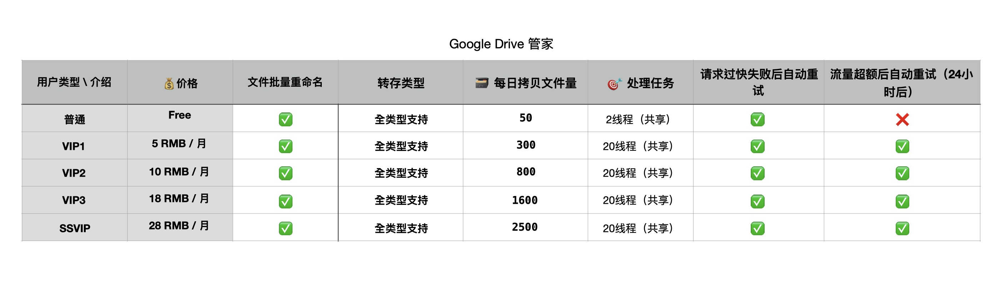

# 谷歌网盘管家·Wiki
🤖 https://t.me/GoogleDriveBot 

谷歌网盘管家是一个协助你管理谷歌网盘文件的Bot。他不能取代也无法取代谷歌网盘管家。

## 🗄功能
### 网盘文件文件转存
#### 使用方法：
授权完成后，Bot对话框执行 `\copy` 命令，按提示填入拷贝来源和目标位置
#### 转存支持类型：
`个人盘 -> 个人盘` ✅ 

`个人分享 -> 个人盘` ✅ 

`个人盘 -> 团队盘` ☑️ 

`团队盘 -> 个人盘` ☑️ 

`团队盘 -> 团队盘` ☑️ 

`团队分享 -> 个人盘` ☑️ 

`个人分享 -> 团队盘` ☑️ 

✅：为稳定功能 

☑️：为测试功能 

#### 转存异常处理：
**转存文件因request过快失败：** 自动重试3次拷贝任务 

**转存文件夹创建失败：** 自动重试3次创建任务 

**转存日总量超过750G：** 24小时+30分钟后重新尝试转存 

### 🗂网盘文件批量重命名 
#### 使用方法
授权完成后，Bot对话框执行`\rename`命令，输入重命名模板

## 使用方案

## ❓Q&A
**提交了转存任务，不能马上收到拷贝成功信息：** 处理任务的队列是共享队列（普通用户2进程并行、VIP用户20进程并行），任务按添加顺序执行。处理速度：处理1k任务需要约7分钟。

## 💰VIP购买途径
授权完成后，Bot对话框执行`\buy`命令。

反馈&建议：@sgdd777
